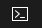

---
lab:
  az204Title: 'Lab 06: Authenticate by using OpenID Connect, MSAL, and .NET SDKs'
  az020Title: 'Lab 06: Authenticate by using OpenID Connect, MSAL, and .NET SDKs'
  az204Module: 'Module 06: Implement user authentication and authorization'
  az020Module: 'Module 06: Implement user authentication and authorization'
ms.openlocfilehash: f782f0fd1729d127304116d81bb5127146c6c4b6
ms.sourcegitcommit: 5590526b3505e9223f15033e1c90cf8007682dfd
ms.translationtype: HT
ms.contentlocale: id-ID
ms.lasthandoff: 07/01/2022
ms.locfileid: "146782577"
---
# <a name="lab-06-authenticate-by-using-openid-connect-msal-and-net-sdks"></a>Lab 06: Mengautentikasi dengan menggunakan OpenID Connect, MSAL, dan SDK .NET

## <a name="microsoft-azure-user-interface"></a>Antarmuka pengguna Microsoft Azure

Mengingat sifat dinamis dari alat cloud Microsoft, Anda mungkin mengalami perubahan antarmuka pengguna Azure yang terjadi setelah pengembangan konten pelatihan ini. Akibatnya, instruksi lab dan langkah-langkah lab mungkin tidak selaras dengan benar.

Microsoft memperbarui kursus pelatihan ini ketika komunitas memberi tahu kami tentang perubahan yang diperlukan. Tetapi, pembaruan cloud sering terjadi, sehingga Anda mungkin mengalami perubahan antarmuka pengguna sebelum pembaruan konten pelatihan ini. **Jika hal ini terjadi, sesuaikan dengan perubahan, lalu kerjakan perubahan di lab sesuai kebutuhan.**

## <a name="instructions"></a>Instruksi

### <a name="before-you-start"></a>Sebelum memulai

#### <a name="sign-in-to-the-lab-environment"></a>Masuk ke lingkungan lab

Masuk ke mesin virtual (VM) Windows 10 Anda menggunakan kredensial berikut:
    
-   Nama pengguna: **Admin**

-   Kata sandi: **Pa55w.rd**

> **Catatan**: Instruktur Anda akan memberikan instruksi untuk terhubung ke lingkungan lab virtual.

#### <a name="review-the-installed-applications"></a>Meninjau aplikasi yang diinstal

Temukan taskbar di desktop Windows 10 Anda. Taskbar berisi ikon untuk aplikasi yang akan Anda gunakan di lab ini, termasuk:

-   Microsoft Edge

-   Visual Studio Code

## <a name="ensure-that-your-lab-environment-has-its-time-set-properly-no-delay-according-to-your-timezone"></a>Pastikan bahwa lingkungan lab Anda telah diatur waktunya dengan benar (tidak ada penundaan, sesuai dengan zona waktu Anda)

>**Catatan:** Jika Anda melihat bahwa lingkungan lab Anda memiliki waktu yang tertunda, sesuaikan waktu lokalnya dengan menggunakan perintah PowerShell berikut untuk menambah waktu 15 menit

```powershell
  Set-Date -Adjust (New-TimeSpan -Minutes 15)
```

## <a name="architecture-diagram"></a>Diagram arsitektur


### <a name="exercise-1-configure-a-single-tenant-azure-ad-environment"></a>Latihan 1: Mengonfigurasi lingkungan Azure Active Directory penyewa tunggal

#### <a name="task-1-open-the-azure-portal"></a>Tugas 1: Membuka portal Microsoft Azure

1. Pada taskbar, pilih ikon **Microsoft Edge**.

1. Di jendela browser yang terbuka, jelajahi portal Microsoft Azure ([portal.azure.com](https://portal.azure.com)), lalu masuk dengan akun yang akan Anda gunakan untuk lab ini.

    > **Catatan**: Jika ini pertama kalinya Anda masuk ke portal Microsoft Azure, Anda akan ditawari tur portal. Pilih **Memulai** untuk melewati tur dan mulai menggunakan portal.

#### <a name="task-2-register-an-application-in-azure-ad"></a>Tugas 2: Mendaftarkan aplikasi di Azure Active Directory

1.  Di portal Microsoft Azure, gunakan kotak teks **Cari sumber daya, layanan, dan dokumen** untuk mencari **Azure Active Directory** dan, dalam daftar hasil, pilih **Azure Active Directory**.

    > **Catatan**: Hal ini akan mengalihkan sesi browser Anda ke panel penyewa Azure Active Directory (Azure AD) yang terkait dengan langganan Azure Anda.

1.  Pada panel **Azure Active Directory**, pilih **Pendaftaran aplikasi** di bagian **Kelola**.

1.  Di bagian **Pendaftaran aplikasi**, pilih **+ Pendaftaran baru**.

1.  Di bagian **Daftar aplikasi**, lakukan tindakan berikut, lalu pilih **Daftar**:

    | Pengaturan | Tindakan |
    | --- | --- |
    | Kotak teks **Nama** | Masukkan **webappoidc** |
    | Daftar **Jenis akun yang didukung** | Pilih **Akun hanya di direktori organisasi ini (Hanya Direktori Default - Penyewa tunggal)** |

    Cuplikan layar berikut menampilkan pengaturan yang dikonfigurasi di bagian **Daftar aplikasi**.

     

#### <a name="task-3-record-unique-identifiers"></a>Tugas 3: Mencatat pengidentifikasi unik

1.  Pada panel pendaftaran aplikasi **webappoidc**, pilih **Ringkasan**.

1.  Di bagian **Ringkasan**, temukan dan catat nilai kotak teks **ID Aplikasi (klien)** . Anda akan menggunakan nilai ini nanti di lab.

1.  Di bagian **Ringkasan**, temukan dan catat nilai kotak teks **ID Direktori (penyewa)** . Anda akan menggunakan nilai ini nanti di lab.

#### <a name="task-4-configure-the-application-authentication-settings"></a>Tugas 4: Mengonfigurasi pengaturan autentikasi aplikasi

1.  Pada panel pendaftaran aplikasi **webappoidc**, pilih **Autentikasi** di bagian **Kelola**.

1.  Di bagian **Autentikasi**, lakukan tindakan berikut, dan pilih **Konfigurasikan**:

    | Pengaturan | Tindakan |
    | --- | --- |
    | Bagian **Konfigurasi platform** | Pilih **+ Tambahkan platform** |
    | Panel **Konfigurasi platform**  | Pilih **Web** |
    | Kotak teks **URI Pengalihan** | Masukkan `https://localhost:44321/` |
    | Kotak teks **URL keluar saluran depan**   | Masukkan  `https://localhost:44321/signout-oidc` |
        
1. Kembali ke bagian **Konfigurasi platform**, pilih **Tambahkan URI**, lalu masukkan `https://localhost:44321/signin-oidc`.

1. Di bagian **Izin implisit dan aliran hibrid**, pilih **Token ID (digunakan untuk aliran implisit dan hibrid)** . 

1. Pilih **Simpan**.

    Cuplikan layar berikut menampilkan pengaturan yang dikonfigurasi pada panel **Autentikasi**.

     
       

#### <a name="task-5-create-an-azure-ad-user"></a>Tugas 5: Membuat pengguna Azure Active Directory

1.  Di portal Microsoft Azure, pilih ikon **Cloud Shell**  untuk membuka sesi PowerShell baru. Jika Cloud Shell defaultnya diatur ke sesi Bash, pilih **Bash** lalu, di menu dropdown, pilih **PowerShell**.

    > **Catatan**: Jika ini adalah pertama kalinya Anda memulai **Cloud Shell**, saat diminta untuk memilih **Bash** atau **PowerShell**, pilih **PowerShell**. Saat pesan **Anda tidak memiliki penyimpanan yang terpasang** muncul, pilih langganan yang Anda gunakan di lab ini, lalu pilih **Buat penyimpanan**.

1.  Di panel **Cloud Shell**, jalankan perintah berikut untuk masuk ke penyewa Azure Active Directory yang terkait dengan langganan Azure Anda:

    ```powershell
    Connect-AzureAD
    ```

1.  Jalankan perintah berikut untuk mengambil dan menampilkan nama domain Sistem Nama Domain (DNS) utama penyewa Azure Active Directory:

    ```powershell
    $aadDomainName = ((Get-AzureAdTenantDetail).VerifiedDomains)[0].Name
    $aadDomainName
    ```

    > **Catatan**: Mencatat nilai nama domain DNS. Anda akan menggunakan nilai ini nanti di lab.

1.  Jalankan perintah berikut untuk membuat pengguna Azure Active Directory yang akan Anda gunakan untuk menguji autentikasi Azure Active Directory:

    ```powershell
    $passwordProfile = New-Object -TypeName Microsoft.Open.AzureAD.Model.PasswordProfile
    $passwordProfile.Password = 'Pa55w.rd1234'
    $passwordProfile.ForceChangePasswordNextLogin = $false
    New-AzureADUser -AccountEnabled $true -DisplayName 'aad_lab_user1' -PasswordProfile $passwordProfile -MailNickName 'aad_lab_user1' -UserPrincipalName "aad_lab_user1@$aadDomainName" 
    ```

1.  Jalankan perintah berikut untuk mengidentifikasi nama utama pengguna (UPN) pengguna Azure Active Directory yang baru dibuat:

    ```powershell
    (Get-AzureADUser -Filter "MailNickName eq 'aad_lab_user1'").UserPrincipalName
    ```

    > **Catatan**: Catat UPNnya. Anda akan menggunakan nilai ini nanti di lab.

    > **Catatan**: Atau, Anda dapat mengambil UPN dengan menggunakan portal Microsoft Azure, buka Azure Active Directory, pilih Bilah pengguna dan cari dengan memberikan userid sebagai input.
    > 


    > Berikut adalah UPN seperti yang disorot.
    > 


1.  Tutup panel Cloud Shell.

#### <a name="review"></a>Tinjau

Dalam latihan ini, Anda mendaftarkan aplikasi Azure Active Directory penyewa tunggal dan membuat akun pengguna Azure Active Directory.

### <a name="exercise-2-create-a-single-tenant-aspnet-core-web-app"></a>Latihan 2: Membuat aplikasi web ASP.NET Core penyewa tunggal

#### <a name="task-1-create-an-aspnet-core-web-app-project"></a>Tugas 1: Membuat proyek aplikasi web ASP.NET Core

1.  Di komputer lab, mulai **Terminal Windows**.

1.  Dari prompt perintah, jalankan perintah berikut untuk membuat dan mengatur direktori kerja ke **Allfiles (F):\\Allfiles\\Labs\\06\\Starter\\OIDCClient**:

    ```powershell
    F:
    cd "F:\Allfiles\Labs\06\Starter\OIDCClient"
    ```

1.  Jalankan perintah berikut untuk membuat aplikasi web .NET Core baru berdasarkan template Model View Controller (MVC) (ganti tempat penampung `<application_ID>`, `<tenant_ID>`, dan `<domain_Name>` dengan nilai yang sesuai yang Anda catat sebelumnya di lab ini) :

    ```powershell
    dotnet new mvc --auth SingleOrg --client-id <application_ID> --tenant-id <tenant_ID> --domain <domain_Name>
    ```

1.  Di komputer lab, buka Visual Studio Code.

1.  Di menu **File**, pilih **Buka Folder**.

1.  Di jendela **File Explorer**, telusuri ke **Allfiles (F):\\Allfiles\\Labs\\06\\Starter\\OIDCClient**, lalu **Pilih Folder**.

1.  Di panel **Explorer** Visual Studio Code, tinjau struktur folder yang dibuat secara otomatis yang mewakili aplikasi web MVC.

1.  Navigasikan ke folder **Properti**, buka file **launchSettings.json**, lalu terapkan perubahan berikut:

    
    | Bagian | Properti  | Nilai |
    | --- | --- | --- |
    | **iisSettings** | **sslPort** | **44321** |
    | **OIDCClient**  | **applicationUrl** | `https://localhost:44321` |

    > **Catatan**: Nomor port harus sesuai dengan nilai yang Anda tentukan saat membuat pendaftaran aplikasi Azure Active Directory.

1.  Simpan dan tutup file.

1.  Di panel **Explorer** Visual Studio Code, pilih **OIDCClient.csproj**.

1.  Pastikan nilai elemen `<TargetFramework>` diatur ke **netcoreapp3.1**.

    > **Catatan**: Mulai dari langkah 12 hingga langkah 15, kami akan memodifikasi **OIDCClient.csproj** dengan menambahkan paket tambahan. Lihat langkah 16 untuk cuplikan konten lengkap terkait konfigurasi.

1.  Atur versi paket `Microsoft.AspNetCore.Authentication.JwtBearer` dan `Microsoft.AspNetCore.Authentication.OpenIdConnect` NuGet ke **3.1.18**. 


1.  Atur versi paket `Microsoft.Identity.Web` dan `Microsoft.Identity.Web.UI` NuGet ke **0.3.1-preview**.

1.  Hapus entri `<WebProject_DirectoryAccessLevelKey>0</WebProject_DirectoryAccessLevelKey>`.

1.  Hapus entri `<PackageReference Include="Microsoft.AspNetCore.Authentication.AzureAD.UI" Version="3.1.7" />`.

1.  Pastikan konten file **OIDCClient.csproj** menyerupai daftar berikut (nilai `UserSecretsId`akan berbeda) dan simpan perubahannya.

    ```csharp
    <Project Sdk="Microsoft.NET.Sdk.Web">
      <PropertyGroup>
        <TargetFramework>netcoreapp3.1</TargetFramework>
        <UserSecretsId>aspnet-OIDCClient-737DEB13-25D4-4C52-93C5-F485367E3C8C</UserSecretsId>
      </PropertyGroup>
      <ItemGroup>
        <PackageReference Include="Microsoft.AspNetCore.Authentication.JwtBearer" Version="3.1.18" NoWarn="NU1605" />
        <PackageReference Include="Microsoft.AspNetCore.Authentication.OpenIdConnect" Version="3.1.18" NoWarn="NU1605" />
        <PackageReference Include="Microsoft.Identity.Web" Version="0.3.1-preview" />
        <PackageReference Include="Microsoft.Identity.Web.UI" Version="0.3.1-preview" />
      </ItemGroup>
    </Project>
    ```

1.  Tutup file **OIDCClient.csproj**.

1.  Navigasikan ke folder **Views\Shared**, lalu buka file **_LoginPartial.cshtml**.

1.  Ganti `AzureAD` dengan `MicrosoftIdentity` di baris berikut:

    ```csharp
    <a class="nav-link text-dark" asp-area="AzureAD" asp-controller="Account" asp-action="SignOut">Sign out</a>`
    ```

1.  Ganti `AzureAD` dengan `MicrosoftIdentity` di baris berikut:

    ```csharp
    <a class="nav-link text-dark" asp-area="AzureAD" asp-controller="Account" asp-action="SignIn">Sign in</a>
    ```

1.  Simpan dan tutup file.

1.  Buka file **appsettings.json** dan tinjau konten objek **AzureAd**, termasuk elemen berikut:

    | Elemen | Nilai |
    | --- | --- |
    | `Instance` | `https://login.microsoftonline.com/` |
    | `Domain` | Domain DNS primer penyewa Azure Active Directory yang terkait dengan langganan Azure Anda. |
    | `TenantId` | GUID penyewa Azure Active Directory. |
    | `ClientId` | ID aplikasi (klien) dari aplikasi yang Anda daftarkan di penyewa Azure Active Directory. |
    | `CallbackPath` | `/signin-oidc` |

1.  Tutup file tanpa membuat perubahan apa pun.

1.  Di panel **Explorer** Visual Studio Code, pilih **Startup.cs**.

1.  Hapus arahan `using Microsoft.AspNetCore.Authentication.AzureAD.UI;`.

1.  Tambahkan arahan **using** berikut langsung setelah entri yang Anda hapus pada langkah sebelumnya:

    ```csharp
    using Microsoft.AspNetCore.Authentication.OpenIdConnect;
    using Microsoft.Identity.Web;
    using Microsoft.Identity.Web.UI;
    ```

1.  Hapus baris berikut dari metode **ConfigureServices**:

    ```csharp
    services.AddAuthentication(AzureADDefaults.AuthenticationScheme)
      .AddAzureAD(options => Configuration.Bind("AzureAd", options));
    ```

1.  Ganti baris yang Anda hapus pada langkah sebelumnya dari metode **ConfigureServices** dengan baris berikut:

    ```csharp
    services.AddAuthentication(OpenIdConnectDefaults.AuthenticationScheme)
      .AddMicrosoftIdentityWebApp(Configuration.GetSection("AzureAd"));
    ```

1.  Hapus baris berikut dari metode **ConfigureServices**:

    ```csharp
    services.AddRazorPages();
    ```

1.  Ganti baris yang Anda hapus pada langkah sebelumnya dari metode **ConfigureServices** dengan baris berikut:

    ```csharp
    services.AddRazorPages()
      .AddMicrosoftIdentityUI();
    ```

1.  Simpan dan tutup file.

### <a name="task-2-test-the-single-tenant-web-app-in-a-single-tenant-scenario"></a>Tugas 2: Menguji aplikasi web penyewa tunggal dalam skenario penyewa tunggal

1.  Di jendela **Visual Studio Code**, aktifkan menu pintasan panel **Explorer**, lalu pilih **Buka di Terminal Terpadu**.

1.  Jalankan perintah berikut untuk membangun aplikasi web .NET:

    ```
    dotnet build
    ```

    > **Catatan**: Jika ada kesalahan build, tinjau file di folder **Allfiles (F):\\Allfiles\\Labs\\06\\Solution\\OIDCClient**.

1.  Jalankan perintah berikut untuk membuat sertifikat yang ditandatangani sendiri dan konfigurasikan komputer lokal untuk memercayainya:

    ```
    dotnet dev-certs https --trust
    ```

1.  Saat diminta untuk menginstal sertifikat yang dibuat secara otomatis, pilih **Ya**.

1.  Dari prompt terminal, jalankan perintah berikut untuk menjalankan aplikasi web .NET:

    ```
    dotnet run
    ```

1.  Mulai browser Microsoft Edge dalam mode **InPrivate**, lalu navigasikan ke URL `https://localhost:44321`.

1.  Jika disajikan dengan pesan **Koneksi Anda tidak privat**, pilih **Tingkat Lanjut**, lalu pilih tautan **Lanjutkan ke host lokal (tidak aman)** .

1.  Di jendela browser yang terbuka, saat diminta, autentikasi dengan menggunakan UPN akun Azure Active Directory **aad_lab_user1** yang Anda buat sebelumnya di lab ini dengan **Pa55w.rd1234** sebagai kata sandinya.

    > **Catatan**: Jika Anda diminta dengan jendela **Bantu kami melindungi akun Anda**, pilih **Lewati untuk sekarang**.

1.  Jendela browser akan secara otomatis membuka halaman web **Izin yang diminta**.

1.  Tinjau izin yang diminta, yang mencakup **Melihat profil dasar Anda** dan **Mempertahankan akses ke data yang telah Anda berikan aksesnya**.

1.  Pilih **Terima**.

1.  Tinjau beranda **Selamat datang** dari situs target yang ditampilkan oleh browser dan verifikasi bahwa UPN akun **aad_user1** Azure Active Directory muncul di jendela browser.

1.  Pada halaman **Selamat datang**, pilih **Keluar**.

1.  Saat diminta memilih akun untuk keluar, pilih akun **aad_lab_user1** Azure Active Directory. Anda akan secara otomatis dialihkan ke halaman **Keluar**.

1.  Biarkan browser Microsoft Edge terbuka yang menampilkan halaman **Keluar**.

#### <a name="review"></a>Tinjau 

Dalam latihan ini, Anda menerapkan aplikasi web penyewa tunggal dan mengujinya di lingkungan Azure penyewa tunggal.

### <a name="exercise-3-configure-a-multitenant-azure-ad-environment"></a>Latihan 3: Mengonfigurasi lingkungan Azure Active Directory multi penyewa

#### <a name="task-1-create-an-azure-ad-tenant"></a>Tugas 1: Membuat penyewa Azure Active Directory

1.  Beralih ke browser Microsoft Edge yang menampilkan portal Microsoft Azure.

1.  Di portal Microsoft Azure, navigasikan ke panel **Azure Active Directory**.

1.  Pada panel **Azure Active Directory**, pilih **Kelola penyewa**, lalu pilih **+ Buat**.

1.  Pada tab **Dasar** pada panel **Buat penyewa**, pastikan opsi **Azure Active Directory** dipilih, lalu pilih **Berikutnya: Konfigurasi >** .

1.  Pada tab **Konfigurasi** pada panel **Buat penyewa**, tentukan pengaturan berikut:

    | Pengaturan | Nilai |
    | --- | --- |
    | Nama organisasi | **Contoso** |
    | Nama domain awal | Nama DNS yang valid terdiri dari huruf kecil dan angka dan dimulai dengan huruf. |
    | Negara/Wilayah | Nama negara atau wilayah Anda. |

1.  Pilih **Tinjau + buat**, lalu pilih **Buat**.

1.  Jika diminta, pada **Bantu kami membuktikan Anda bukan robot**, masukkan kode yang disediakan, lalu pilih **Kirim**.

1.  Tunggu hingga provisi selesai, lalu pilih tautan **Contoso** untuk menavigasi ke panel yang menampilkan properti penyewa Contoso Azure Active Directory.

1.  Pada panel **Ringkasan** penyewa Azure Active Directory, identifikasi dan catat nilai properti **ID Penyewa**. Anda akan menggunakan nilai ini nanti di lab.

#### <a name="task-2-create-an-azure-ad-user"></a>Tugas 2: Membuat pengguna Azure Active Directory

1.  Di jendela browser web yang menampilkan portal Microsoft Azure, pilih ikon panel alat **Direktori + langganan**.

1.  Pada panel **Pengaturan portal | Direktori + langganan**, pilih **Beralih** di samping entri yang mewakili penyewa Azure Active Directory yang terkait dengan langganan Anda.

1.  Di portal Microsoft Azure, pilih ikon **Cloud Shell** untuk membuka sesi PowerShell baru. 

1.  Di panel **Cloud Shell**, jalankan perintah berikut untuk masuk ke penyewa Contoso Azure Active Directory. Ganti tempat penampung `<tenant_Id>` dengan nilai properti ID penyewa yang Anda identifikasi di tugas sebelumnya:

    ```powershell
    Import-Module AzureAD.Standard.Preview
    AzureAD.Standard.Preview\Connect-AzureAD -TenantID '<tenant_ID>'
    ```

1.  Ctrl + Klik URL di PERINGATAN untuk membuka jendela browser dan ikuti langkah-langkah untuk mengautentikasi.  

1.  Jalankan perintah berikut untuk mengambil nama domain DNS penyewa Azure Active Directory:

    ```powershell
    $aadDomainName = ((Get-AzureAdTenantDetail).VerifiedDomains)[0].Name
    ```

1.  Jalankan perintah berikut untuk membuat pengguna Azure Active Directory yang akan Anda gunakan untuk menguji autentikasi Azure Active Directory:

    ```powershell
    $passwordProfile = New-Object -TypeName Microsoft.Open.AzureAD.Model.PasswordProfile
    $passwordProfile.Password = 'Pa55w.rd1234'
    $passwordProfile.ForceChangePasswordNextLogin = $false
    New-AzureADUser -AccountEnabled $true -DisplayName 'aad_lab_user2' -PasswordProfile $passwordProfile -MailNickName 'aad_lab_user2' -UserPrincipalName "aad_lab_user2@$aadDomainName"
    ```

1.  Jalankan perintah berikut untuk mengidentifikasi UPN pengguna Azure Active Directory yang baru dibuat:

    ```powershell
    (Get-AzureADUser -Filter "MailNickName eq 'aad_lab_user2'").UserPrincipalName
    ```

    > **Catatan**: Catat UPNnya. Anda akan menggunakan nilai ini nanti di lab.
 
1.  Tutup panel **Cloud Shell**.

#### <a name="task-3-test-the-single-tenant-web-app-in-a-multitenant-scenario"></a>Tugas 3: Menguji aplikasi web penyewa tunggal dalam skenario multi penyewa

1.  Beralih kembali ke browser Microsoft Edge, dalam mode **InPrivate**, yang menampilkan halaman **Keluar**, lalu pilih **Masuk**.

1.  Di jendela browser yang terbuka, saat diminta, autentikasi dengan menggunakan UPN akun Azure Active Directory **aad_lab_user2** yang Anda buat sebelumnya dalam latihan ini dengan **Pa55w.rd1234** sebagai kata sandinya.

1.  Perhatikan pesan kesalahan yang menunjukkan bahwa akun pengguna yang Anda gunakan tidak ada di penyewa tempat aplikasi web **webappoidc** terdaftar.

    > **Catatan**: Agar masuk berfungsi dalam skenario ini, Anda harus terlebih dahulu menambahkan akun ini sebagai pengguna eksternal ke penyewa yang menghosting pendaftaran aplikasi web webappoidc.

1.  Tutup browser Microsoft Edge yang menampilkan pesan kesalahan, lalu alihkan kembali ke jendela **Visual Studio Code**.

1.  Di panel **terminal**, pilih **Hentikan Terminal** (ikon **Tempat Sampah**) untuk menutup terminal yang sedang terbuka dan semua proses terkait.

#### <a name="review"></a>Tinjau

Dalam latihan ini, Anda mengonfigurasi lingkungan Azure multi penyewa dan mengujinya dengan aplikasi web penyewa tunggal.

### <a name="exercise-4-configure-a-multitenant-aspnet-core-web-app"></a>Latihan 4: Mengonfigurasi aplikasi web ASP.NET Core multi penyewa

#### <a name="task-1-configure-the-application-registration-in-azure-ad"></a>Tugas 1: Mengonfigurasi pendaftaran aplikasi di Azure Active Directory

1.  Beralih ke portal Microsoft Azure, lalu pilih ikon panel alat **Direktori + langganan**.

1.  Pada panel **Pengaturan portal | Direktori + langganan**, pilih **Beralih** di samping entri yang mewakili penyewa Azure Active Directory yang terkait dengan langganan Anda.

1.  Pada panel **Azure Active Directory**, pilih **Pendaftaran aplikasi** di bagian **Kelola**.

1.  Dalam daftar pendaftaran aplikasi, pilih **webappoidc**.

1.  Pada panel pendaftaran aplikasi **webappoidc**, pilih **Autentikasi** di bagian **Kelola**.

1.  Di bagian **Jenis akun yang didukung**, pilih **Akun di direktori organisasi apa pun (Direktori Azure AD apa pun - Multi-penyewa)** .

1.  Pilih **Simpan**.

    Cuplikan layar berikut menampilkan pengaturan yang dikonfigurasi pada panel **Pendaftaran aplikasi**.
          
     

    
#### <a name="task-2-configure-multi-tenancy-support-of-the-aspnet-core-web-app"></a>Tugas 2: Mengonfigurasi dukungan multi penyewa dari aplikasi web ASP.NET Core

1.  Di komputer lab, buka Visual Studio Code.

1.  Buka file **appsettings.json**.

1.  Ganti baris yang berisi elemen `TenantId` dengan baris berikut:

    ```
    "TenantId": "organizations", 
    ```

1.  Simpan dan tutup file.

### <a name="task-3-test-the-multitenant-web-app-in-a-multitenant-scenario"></a>Tugas 3: Menguji aplikasi web multi penyewa dalam skenario multi penyewa

1.  Di jendela **Visual Studio Code**, aktifkan menu pintasan panel **Explorer**, lalu pilih **Buka di Terminal Terpadu**.

1.  Dari prompt terminal, jalankan perintah berikut untuk menjalankan aplikasi web .NET:

    ```
    dotnet run
    ```

1.  Mulai browser Microsoft Edge dalam mode **InPrivate**, lalu navigasikan ke URL `https://localhost:44321`.

1.  Jika disajikan dengan pesan **Koneksi Anda tidak privat**, pilih **Tingkat Lanjut**, lalu pilih tautan **Lanjutkan ke host lokal (tidak aman)** .

1.  Di jendela browser yang terbuka, saat diminta, autentikasi dengan menggunakan UPN akun Azure Active Directory **aad_lab_user1** yang Anda buat sebelumnya di lab ini dengan **Pa55w.rd1234** sebagai kata sandinya.

1.  Tinjau beranda **Selamat datang** dari situs target yang ditampilkan browser, lalu verifikasi bahwa UPN akun **aad_lab_user1** Azure Active Directory muncul di jendela browser.

1.  Pada halaman **Selamat datang**, pilih **Keluar**.

1.  Saat diminta memilih akun untuk keluar, pilih akun **aad_lab_user1** Azure Active Directory. Anda akan secara otomatis dialihkan ke halaman **Keluar**.

1.  Di browser Microsoft Edge yang menampilkan halaman **Keluar**, pilih **Masuk**.

1.  Di jendela browser yang terbuka, saat diminta, autentikasi dengan menggunakan UPN akun Azure Active Directory **aad_lab_user2** yang Anda buat sebelumnya dalam latihan ini dengan **Pa55w.rd1234** sebagai kata sandinya.

1.  Jendela browser akan secara otomatis membuka halaman web **Izin yang diminta**.

1.  Tinjau izin yang diminta, yang mencakup **Melihat profil dasar Anda** dan **Mempertahankan akses ke data yang telah Anda berikan aksesnya**.

1.  Pilih **Terima**.

    > **Catatan**: Aplikasi terdaftar sebagai belum diverifikasi. Hal ini diharapkan, karena aplikasi sampel yang Anda gunakan di lab ini belum menjalani verifikasi penerbit. Untuk informasi selengkapnya, lihat dokumentasi Microsoft yang menjelaskan [verifikasi penerbit](https://docs.microsoft.com/en-us/azure/active-directory/develop/publisher-verification-overview).

1.  Tinjau beranda **Selamat datang** dari situs target yang ditampilkan browser, lalu verifikasi bahwa UPN akun **aad_lab_user2** Azure Active Directory muncul di jendela browser.

1.  Pada halaman **Selamat datang**, pilih **Keluar**.

1.  Tutup browser Microsoft Edge dalam mode **InPrivate**, lalu alihkan kembali ke jendela **Visual Studio Code**.

1.  Di panel **terminal**, pilih **Hentikan Terminal** (ikon **Tempat Sampah**) untuk menutup terminal yang sedang terbuka dan semua proses terkait.

#### <a name="review"></a>Tinjau

Dalam latihan ini, Anda menerapkan aplikasi web multi penyewa dan mengujinya di lingkungan Azure multi penyewa.

### <a name="exercise-5-clean-up-your-subscription"></a>Latihan 5: Membersihkan langganan Anda

#### <a name="task-1-delete-the-application-registration-in-azure-ad"></a>Tugas 1: Menghapus pendaftaran aplikasi di Azure Active Directory

1.  Beralih ke browser Microsoft Edge yang menampilkan portal Microsoft Azure.

1.  Di portal Microsoft Azure, navigasikan ke panel penyewa Contoso Azure Active Directory. Tindakan ini akan menampilkan panel **Contoso \| Ringkasan**.

1.  Pada panel **Azure Active Directory**, pilih **Aplikasi perusahaan** di bagian **Kelola**.

1.  Pada panel **Aplikasi perusahaan \| Semua aplikasi**, pilih **webappoidc**.

1.  Pada panel **webappoidc \| Ringkasan**, pilih **Properti**.

1.  Pada panel Properti **webappoidc \|** , pilih **Hapus** dan, saat diminta untuk mengonfirmasi, pilih **Ya**.

1.  Navigasikan ke panel **Pengguna \| Semua pengguna (Pratinjau)** penyewa Contoso Azure Active Directory.

1.  Dalam daftar pengguna, pilih **aad_lab_user2**.

1.  Pada panel **aad_lab_user2 \| Profil**, pilih **Hapus** lalu, saat diminta untuk mengonfirmasi, pilih **Ya**.

1.  Navigasikan kembali ke panel **Contoso \| Ringkasan**, lalu pilih **Kelola penyewa**.

1.  Dalam daftar penyewa, centang kotak di samping entri **Contoso (Default)** , lalu pilih **Hapus**.

1.  Di panel **Hapus penyewa 'Contoso'?** , pilih **Hapus**.

1.  Jika perlu, pilih **Dapatkan izin untuk menghapus sumber daya Azure**, pada panel **Properti** penyewa Azure Active Directory, di **Manajemen akses untuk sumber daya Azure**, pilih **Ya**, lalu pilih **Simpan**.

1.  Navigasikan kembali ke panel **Hapus penyewa 'Contoso'?** , refresh halaman browser, pilih **Hapus**, lalu pilih **Ya** untuk mengonfirmasi.

1.  Di portal Microsoft Azure, navigasikan kembali ke panel penyewa Azure Active Directory yang terkait dengan langganan Azure Anda.

1.  Pada panel **Azure Active Directory**, pilih **Pendaftaran aplikasi** di bagian **Kelola**.

1.  Di bagian **Pendaftaran aplikasi**, pilih pendaftaran aplikasi Azure Active Directory **webappoidc** yang Anda buat sebelumnya di lab ini.

1.  Di bagian **webappoidc**, lakukan tindakan berikut:

    a. Pilih **Hapus**.

    b. Pada panel **Hapus pendaftaran aplikasi**, pilih **Saya memahami implikasi dari menghapus pendaftaran aplikasi ini**, lalu pilih **Hapus**.

1.  Navigasikan ke panel **Pengguna \| Semua pengguna (Pratinjau)** .

1.  Dalam daftar pengguna, pilih **aad_lab_user1**

1.  Pada panel **aad_lab_user1 \| Profil**, pilih **Hapus** dan, saat diminta untuk mengonfirmasi, pilih **Ya**.

#### <a name="task-2-close-the-active-applications"></a>Tugas 2: Menutup aplikasi yang aktif

1.  Tutup semua jendela Microsoft Edge yang terbuka.

1.  Tutup Visual Studio Code.

#### <a name="review"></a>Tinjau

Dalam latihan ini, Anda membersihkan langganan Anda dengan menghapus pendaftaran aplikasi yang digunakan di lab ini.
